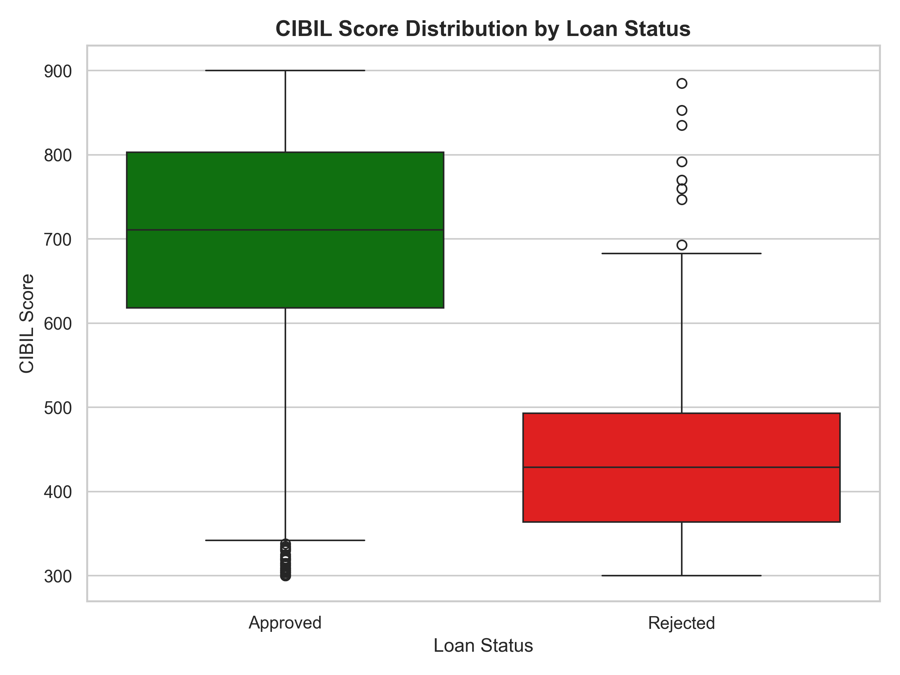
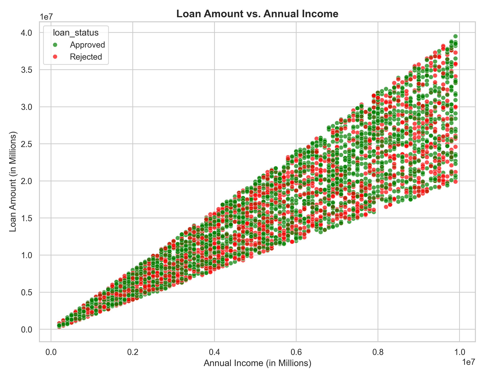
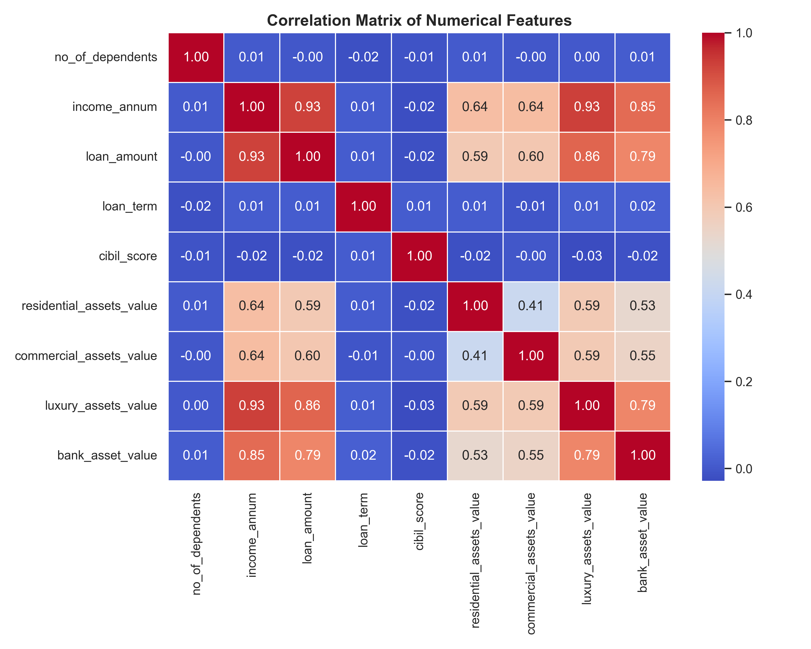

# Loan Approval Prediction - Machine Learning Project

A complete end-to-end Machine Learning project that predicts whether a loan application will be **Approved** or **Rejected** based on applicant features like income, CIBIL score, assets, and more.

## Project Overview

This project demonstrates a full ML pipeline:
- **Data Acquisition** — Downloads the complete 4,269-record dataset
- **Data Preprocessing** — Handles missing values, encodes categorical features, scales numerical features
- **Model Training** — Trains and compares Logistic Regression, Decision Tree, and Random Forest classifiers
- **Model Evaluation** — Compares models using Accuracy, F1-Score, and ROC-AUC
- **Inference** — Provides a CLI tool to predict loan status for new applicants

## Dataset

The dataset contains **4,269 loan applications** with 13 features:

| Feature | Description |
|---|---|
| `loan_id` | Unique loan identifier |
| `no_of_dependents` | Number of dependents |
| `education` | Graduate / Not Graduate |
| `self_employed` | Yes / No |
| `income_annum` | Annual income |
| `loan_amount` | Requested loan amount |
| `loan_term` | Loan term in months |
| `cibil_score` | Credit score (300-900) |
| `residential_assets_value` | Value of residential assets |
| `commercial_assets_value` | Value of commercial assets |
| `luxury_assets_value` | Value of luxury assets |
| `bank_asset_value` | Value of bank assets |
| `loan_status` | Target — Approved / Rejected |

## Model Comparison Results

| Model | Accuracy | F1-Score | ROC-AUC |
|---|---|---|---|
| Logistic Regression | 91.33% | 93.15% | 97.34% |
| Decision Tree | 98.13% | 98.49% | 98.01% |
| **Random Forest** | **98.24%** | **98.59%** | **99.89%** |

**Best Model: Random Forest** with 98.59% F1-Score and 99.89% ROC-AUC.

## EDA Visualizations

### CIBIL Score Distribution by Loan Status


### Loan Amount vs Annual Income


### Correlation Heatmap


## Setup & Installation

```bash
# Clone the repository
git clone https://github.com/imshubham22apr-gif/Loan-Approval-Prediction-ML.git
cd Loan-Approval-Prediction-ML

# Install dependencies
pip install pandas numpy scikit-learn matplotlib seaborn joblib
```

## Usage

### 1. Train the Model
```bash
python main.py
```
This will:
- Download the dataset (if not already present)
- Clean and preprocess the data
- Train 3 models and compare them
- Save the best model to `models/` directory

### 2. Generate Visualizations
```bash
python visualize.py
```
Generates EDA plots in the `plots/` directory.

### 3. Predict Loan Status (CLI)
```bash
# Interactive mode - enter applicant details manually
python predict.py

# Demo mode - uses sample data
python predict.py --demo
```

**Demo output:**
```
==================================================
  Prediction: APPROVED
  Confidence - Rejected: 1.00%  |  Approved: 99.00%
==================================================
```

## Project Structure

```
Loan-Approval-Prediction-ML/
|-- main.py                  # Full ML pipeline (train + evaluate + save)
|-- data_cleaner.py          # Data loading, cleaning, preprocessing
|-- model.py                 # Model training, evaluation, serialization
|-- visualize.py             # EDA plot generation
|-- predict.py               # CLI inference tool
|-- download_data.py         # Dataset downloader
|-- loan_approval_dataset.csv # Dataset (4,269 records)
|-- .gitignore
|-- README.md
|-- models/                  # Saved model & preprocessor artifacts (generated)
|-- plots/                   # Generated EDA visualizations
```

## Tech Stack

- **Python 3.11**
- **pandas** — Data manipulation
- **NumPy** — Numerical operations
- **scikit-learn** — ML models, preprocessing, evaluation
- **matplotlib & seaborn** — Data visualization
- **joblib** — Model serialization

## Author

**Shubham** — [GitHub](https://github.com/imshubham22apr-gif)

## License

This project is open source and available under the [MIT License](LICENSE).
